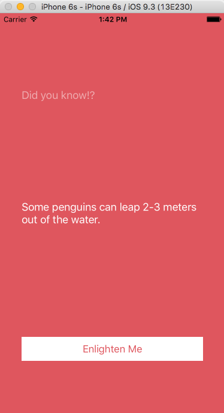
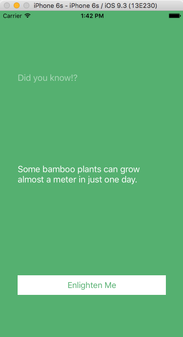

## **PleasantReminders** is a Swift iOS app that provides users with random (often absurd) trivia at the press of a button.

### Objectives

#### This is my first iOS app and was inspired by a Treehouse tutorial. I thought it would be interesting to dive-into iOS development, so this project allowed me to learn some of the basics of Swift: data types, control flow, conditionals, MVC practices, version control, and the various intricacies of using the Apple's IDE Xcode.

